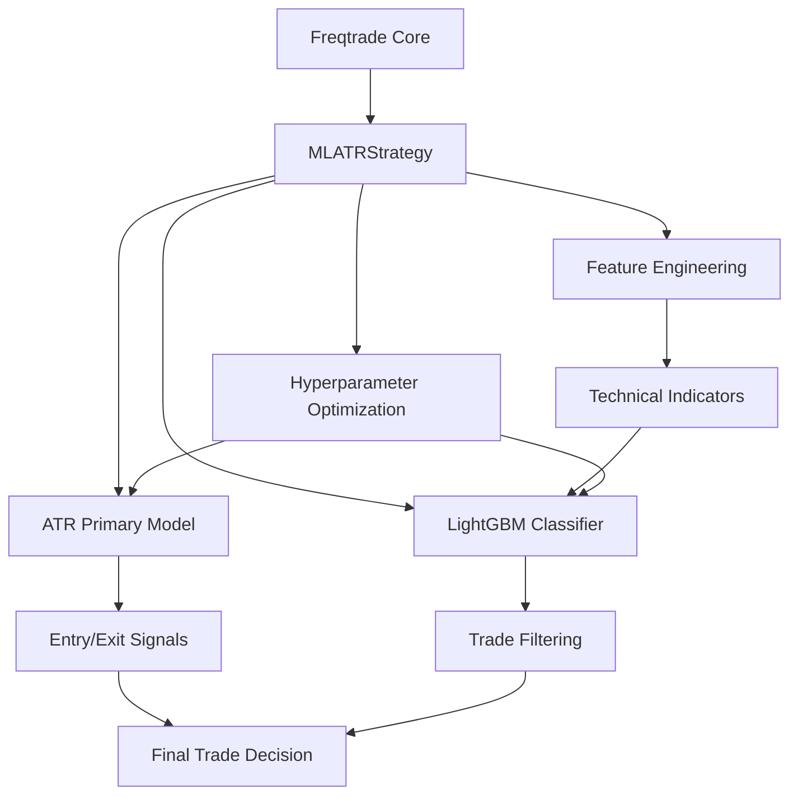
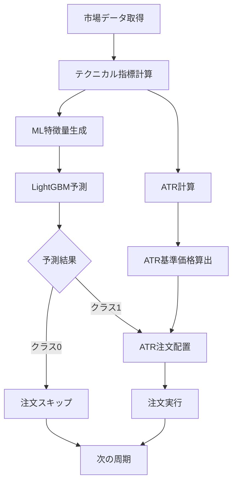
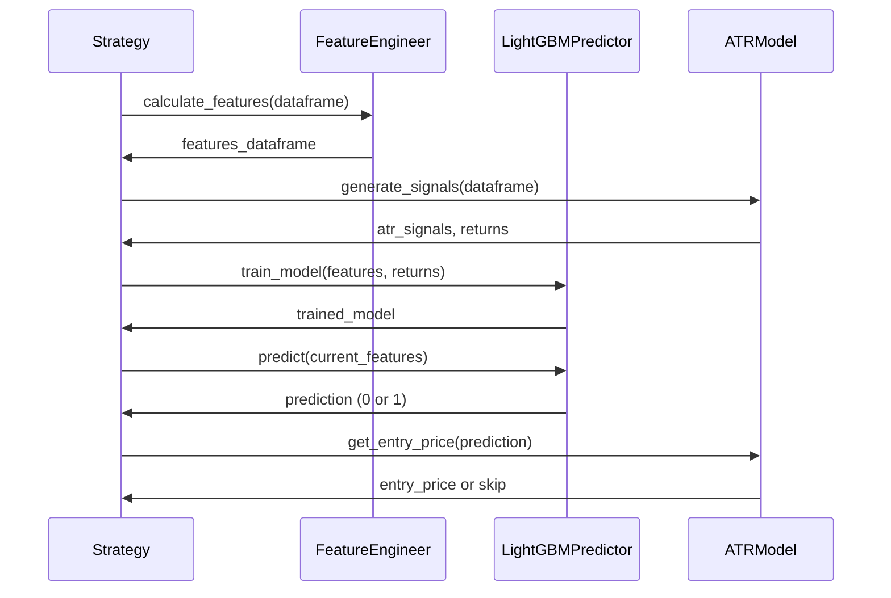

# 技術設計文書

## 概要

**目的**: この機能は、ATRベース指値戦略とLightGBM機械学習分類を組み合わせた2層トレーディングシステムを提供し、Freqtradeユーザーに対してリスク制御された高度なトレード実行を実現します。

**ユーザー**: Freqtradeを使用する定量トレーダーと戦略開発者が、richmanbtcチュートリアルの概念を活用した機械学習強化トレーディングに利用します。

**影響**: 既存のFreqtrade戦略フレームワークを拡張し、1次モデル（ATR戦略）と2次モデル（ML分類）を統合した新しい戦略パターンを導入します。

### 目標

- ATRベース指値戦略と機械学習分類の2層システム実装
- Freqtradeの既存バックテストシステムとの完全統合
- richmanbtcチュートリアル概念の忠実な再現とFreqtrade適応
- ハイパーパラメータ最適化によるパフォーマンス向上

### 非目標

- 新しいバックテストエンジンの開発（既存のFreqtradeバックテストを使用）
- リアルタイムトレーディング機能の変更（戦略レベルでの実装）
- FreqAIフレームワークの置き換え（独立したML実装として構築）

## アーキテクチャ

### 既存アーキテクチャ分析

Freqtradeの現在のアーキテクチャパターンと制約:

- **IStrategy基底クラス**: 戦略実装の標準インターface（populate_indicators、populate_entry_trend、custom_entry_price等）
- **プラグインアーキテクチャ**: 戦略は独立したモジュールとして実装
- **データプロバイダー**: 履歴データとリアルタイムデータの統一インターface
- **最適化フレームワーク**: Optunaベースのハイパーパラメータ最適化

維持すべき既存ドメイン境界:

- 戦略ロジックとコア取引エンジンの分離
- データ管理層との抽象化
- 設定管理とパラメータ検証の標準化

### 高レベルアーキテクチャ



**アーキテクチャ統合**:

- 既存パターンの保持: IStrategy継承、populate_*メソッドパターン、DataProvider利用
- 新コンポーネントの合理性: 2層モデル統合のための専用コンポーネント（MLATRStrategy、FeatureEngineer、LightGBMPredictor）
- 技術スタック整合性: Python 3.11+、pandas、LightGBM 4.6.0.99、既存のFreqtrade依存関係
- ステアリング準拠: モジュラーアーキテクチャ、プラグインシステム、API-Firstデザインの維持

### 技術整合性

既存技術スタックとの整合:

- **Python 3.11+**: Freqtradeの最小要件に準拠
- **Pandas**: 既存のデータ処理パイプラインと互換
- **LightGBM 4.6.0.99**: scikit-learn互換インターfaceを使用
- **TA-Lib/ft-pandas-ta**: 既存テクニカル指標ライブラリの活用

新規依存関係:

- LightGBM（Freqtradeの任意依存関係として既に利用可能）
- 追加のテクニカル指標計算用ライブラリなし（既存ライブラリで充分）

既存パターンからの逸脱:

- ML予測ロジックの統合（ただしFreqAIとは独立実装）
- 2層決定メカニズム（ATR + ML分類）

**主要設計決定**:

- **決定**: IStrategy継承による戦略実装
- **コンテキスト**: Freqtradeの既存戦略フレームワークとの統合要件
- **代替案**: FreqAI利用、独立サービス、カスタムエンジン
- **選択アプローチ**: IStrategyを継承したMLATRStrategyクラスで2層ロジックを実装
- **合理性**: 既存バックテストシステムとの完全互換性、学習コストの最小化、保守性の確保
- **トレードオフ**: 実装の柔軟性vs既存システムとの統合容易性（統合容易性を重視）

- **決定**: LightGBM単体による機械学習実装
- **コンテキスト**: 2次モデルとしての二値分類要件
- **代替案**: FreqAI統合、アンサンブル手法、深層学習
- **選択アプローチ**: LightGBMClassifierの直接利用
- **合理性**: richmanbtcチュートリアルとの概念的整合性、高速訓練、解釈可能性
- **トレードオフ**: モデルの複雑性vs実装・保守の容易性（実装容易性を重視）

## システムフロー

### 2層決定フロー



### 訓練・予測フロー



## 要件トレーサビリティ

| 要件 | 要件概要 | コンポーネント | インターface | フロー |
|------|----------|--------------|-------------|-----|
| 1.1-1.8 | ATRベース主要戦略 | ATRModel, MLATRStrategy | populate_indicators, custom_entry_price | 2層決定フロー |
| 2.1-2.5 | テクニカル指標特徴量 | FeatureEngineer | calculate_features | 訓練・予測フロー |
| 3.1-3.6 | LightGBM分類モデル | LightGBMPredictor | train_model, predict | 訓練・予測フロー |
| 4.1-4.6 | ハイパーパラメータ最適化 | MLATRStrategy, HyperoptHandler | optimize_parameters | Optuna統合 |
| 5.1-5.7 | 統合2層実行 | MLATRStrategy | populate_entry_trend, confirm_trade_entry | 2層決定フロー |
| 6.1-6.5 | richmanbtcチュートリアル適用 | ATRModel, MLATRStrategy | richmanbtc概念実装 | 全フロー |

## コンポーネントとインターface

### 戦略層

#### MLATRStrategy

**責任と境界**

- **主責任**: 2層トレーディングロジックの統合と実行
- **ドメイン境界**: Freqtrade戦略ドメイン（取引決定とシグナル生成）
- **データ所有権**: 戦略パラメータ、モデル状態、予測結果
- **トランザクション境界**: 単一トレード決定における一貫性

**依存関係**

- **インバウンド**: FreqtradeBot（analyze_ticker経由）
- **アウトバウンド**: ATRModel、LightGBMPredictor、FeatureEngineer
- **外部**: pandas、numpy、Freqtrade DataProvider

**契約定義**

```python
from freqtrade.strategy import IStrategy
from typing import Dict, Optional
import pandas as pd

class MLATRStrategy(IStrategy):
    # Strategy configuration
    entry_length: int = 14
    entry_point: float = 0.5
    ml_enabled: bool = True
    ml_training_window: int = 1000

    def populate_indicators(self, dataframe: pd.DataFrame, metadata: Dict) -> pd.DataFrame:
        """ATRと機械学習特徴量を含む全指標を計算"""
        # Preconditions: dataframe contains OHLCV data
        # Postconditions: Returns dataframe with ATR and ML features
        # Invariants: Original dataframe structure preserved

    def populate_entry_trend(self, dataframe: pd.DataFrame, metadata: Dict) -> pd.DataFrame:
        """2層決定ロジックによるエントリシグナル生成"""
        # Preconditions: populated indicators in dataframe
        # Postconditions: 'enter_long' column added with binary signals
        # Invariants: Only modifies signal columns

    def custom_entry_price(self, pair: str, trade: Optional[Trade],
                          current_time: datetime, proposed_rate: float,
                          entry_tag: str, side: str, **kwargs) -> float:
        """ATR基準の指値価格計算"""
        # Preconditions: Valid pair data and ATR calculated
        # Postconditions: Returns limit price based on ATR
        # Invariants: Price within market bounds
```

**状態管理**

- **状態モデル**: 初期化 → 訓練中 → 予測中 → 更新中の遷移
- **永続化**: モデル状態をPickleファイルとして保存
- **並行性**: 単一戦略インスタンスでの楽観的制御

**統合戦略**

- **変更アプローチ**: IStrategyを継承し、既存メソッドをオーバーライド
- **後方互換性**: 既存のFreqtrade設定ファイルとの互換性維持
- **移行パス**: 新戦略クラスとして追加、既存戦略への影響なし

### 機械学習層

#### LightGBMPredictor

**責任と境界**

- **主責任**: LightGBM二値分類モデルの訓練と予測
- **ドメイン境界**: 機械学習ドメイン（特徴量処理と予測）
- **データ所有権**: 訓練済みモデル、特徴量重要度、予測結果
- **トランザクション境界**: モデル訓練および予測の原子性

**依存関係**

- **インバウンド**: MLATRStrategy
- **アウトバウンド**: なし
- **外部**: LightGBM 4.6.0.99、scikit-learn、pandas

**外部依存関係調査**:
LightGBM 4.6.0.99の公式ドキュメントによると、LGBMClassifierは以下の主要パラメータをサポート:

- n_estimators (default: 100): ブースティング段階数
- learning_rate (default: 0.1): ブースティング学習率
- max_depth (default: -1): 木の最大深度（-1は制限なし）
- min_data_in_leaf (default: 20): 葉ノードの最小データ数
- class_weight (default: None): クラス重み（'balanced'で自動バランス）
- random_state: 再現性確保のための乱数シード

**契約定義**

```python
from lightgbm import LGBMClassifier
from typing import Tuple, Dict, Any
import pandas as pd
import numpy as np

class LightGBMPredictor:
    def train_model(self, features: pd.DataFrame, targets: pd.Series) -> Dict[str, Any]:
        """特徴量とターゲットからモデルを訓練"""
        # Preconditions: features and targets have same length, no NaN values
        # Postconditions: Returns trained model and performance metrics
        # Invariants: Model state is consistent and serializable

    def predict(self, features: pd.DataFrame) -> np.ndarray:
        """訓練済みモデルで予測を実行"""
        # Preconditions: Model is trained, features match training schema
        # Postconditions: Returns binary predictions (0 or 1)
        # Invariants: Prediction output is deterministic for same input

    def get_feature_importance(self) -> Dict[str, float]:
        """特徴量重要度を取得"""
        # Preconditions: Model is trained
        # Postconditions: Returns feature importance scores
        # Invariants: Sum of importance scores equals 1.0
```

#### FeatureEngineer

**責任と境界**

- **主責任**: テクニカル指標の計算と機械学習特徴量の生成
- **ドメイン境界**: 特徴量エンジニアリングドメイン（データ変換）
- **データ所有権**: 計算済み特徴量、特徴量メタデータ
- **トランザクション境界**: 特徴量計算バッチの一貫性

**依存関係**

- **インバウンド**: MLATRStrategy
- **アウトバウンド**: なし
- **外部**: pandas、numpy、TA-Lib、ft-pandas-ta

**契約定義**

```python
import pandas as pd
from typing import List, Dict

class FeatureEngineer:
    def calculate_features(self, dataframe: pd.DataFrame) -> pd.DataFrame:
        """包括的なテクニカル指標特徴量を計算"""
        # Preconditions: dataframe contains OHLCV columns
        # Postconditions: Returns dataframe with 10+ technical indicators
        # Invariants: Original OHLCV data preserved

    def get_feature_names(self) -> List[str]:
        """特徴量名のリストを取得"""
        # Preconditions: Features have been calculated at least once
        # Postconditions: Returns consistent feature name list
        # Invariants: Feature names match calculated columns
```

### ドメインモデル層

#### ATRModel

**責任と境界**

- **主責任**: ATRベース指値戦略の実装と価格計算
- **ドメイン境界**: ATR戦略ドメイン（テクニカル分析と価格決定）
- **データ所有権**: ATR値、指値価格、戦略パラメータ
- **トランザクション境界**: ATR計算と価格決定の原子性

**契約定義**

```python
import pandas as pd
from typing import Dict, Tuple, Optional

class ATRModel:
    def calculate_atr(self, dataframe: pd.DataFrame, period: int = 14) -> pd.Series:
        """ATRを計算"""
        # Preconditions: dataframe contains high, low, close columns
        # Postconditions: Returns ATR series with same index
        # Invariants: ATR values are non-negative

    def generate_entry_signals(self, dataframe: pd.DataFrame) -> pd.DataFrame:
        """ATRベースのエントリシグナルを生成"""
        # Preconditions: ATR calculated in dataframe
        # Postconditions: Returns dataframe with entry signals and returns
        # Invariants: Signal generation is deterministic

    def calculate_limit_price(self, current_price: float, atr_value: float,
                            side: str) -> float:
        """ATR基準の指値価格を計算"""
        # Preconditions: current_price > 0, atr_value > 0, side in ['buy', 'sell']
        # Postconditions: Returns limit price based on ATR distance
        # Invariants: Buy price < current_price, Sell price > current_price
```

## データモデル

### ドメインモデル

**中核概念**:

- **TradingSignal**: エントリ/エグジット決定の集約体
  - ATRSignal（価格と距離情報）
  - MLPrediction（分類結果と信頼度）
  - FinalDecision（統合された取引決定）
- **FeatureVector**: ML入力用の標準化された特徴量
- **ModelState**: 訓練済みモデルとメタデータの状態

**ビジネスルールと不変条件**:

- ATR値は常に正の値である
- ML予測は0または1の二値である
- 最終取引決定はATRシグナルとML予測の論理積である
- 特徴量計算では欠損値の適切な処理が必要である

### 論理データモデル

**構造定義**:

```python
@dataclass
class TradingSignal:
    atr_signal: bool
    atr_price: float
    atr_distance: float
    ml_prediction: int
    ml_confidence: float
    final_decision: bool
    timestamp: datetime

@dataclass
class FeatureVector:
    features: Dict[str, float]
    feature_names: List[str]
    timestamp: datetime
    pair: str

@dataclass
class ModelState:
    model: LGBMClassifier
    feature_importance: Dict[str, float]
    training_metrics: Dict[str, float]
    last_trained: datetime
    version: str
```

**整合性と完全性**:

- 取引決定境界: 単一の市場データポイントでの一貫性
- 参照整合性: 特徴量とモデル入力スキーマの一致
- 時系列側面: データポイントの時間順序保証

## エラーハンドリング

### エラー戦略

**データ品質エラー**: 欠損値やデータ不足 → デフォルト値補間または周期スキップ
**モデル訓練エラー**: 不十分なデータやモデル収束失敗 → 主要ATRモデルのみで継続
**予測エラー**: モデル予測失敗 → フォールバック予測（保守的な0予測）

### エラーカテゴリと対応

**ユーザーエラー** (設定): 無効なパラメータ → バリデーション時に明確なエラーメッセージ; 未サポート設定 → デフォルト値への自動フォールバック
**システムエラー** (5xx): データプロバイダー障害 → キャッシュデータでの継続; メモリ不足 → バッチサイズ削減; モデル予測タイムアウト → サーキットブレーカー
**ビジネスロジックエラー** (422): ATR計算不可 → 周期スキップとログ記録; 特徴量不足 → 最小特徴量セットでの継続

### モニタリング

**エラー追跡**: Freqtradeの既存ログシステムを使用した構造化ログ
**ヘルスモニタリング**: モデル予測精度の監視、ATR計算成功率の追跡
**パフォーマンス指標**: 予測レイテンシ、メモリ使用量、訓練時間の監視

## テスト戦略

### ユニットテスト

- ATRModel.calculate_atr: 既知データでのATR計算精度検証
- LightGBMPredictor.train_model: 合成データでのモデル訓練とメトリクス
- FeatureEngineer.calculate_features: 特徴量計算の正確性と欠損値処理
- MLATRStrategy.populate_indicators: 指標計算とデータフレーム整合性
- MLATRStrategy.custom_entry_price: ATR基準価格計算ロジック

### 統合テスト

- ATR + ML統合フロー: 2層決定プロセスの端対端テスト
- Freqtradeバックテスト統合: 既存バックテストシステムとの互換性
- データプロバイダー統合: 履歴データとリアルタイムデータでの動作
- ハイパーパラメータ最適化: Optuna統合とパラメータ最適化フロー
- エラーハンドリング統合: 各種エラー条件での適切なフォールバック

### パフォーマンステスト

- 大規模データセット処理: 10,000+ キャンドルでの処理性能
- ML訓練スケーラビリティ: 異なるデータサイズでの訓練時間測定
- リアルタイム予測レイテンシ: 予測処理時間の境界値テスト
- メモリ使用量プロファイリング: 長期間実行でのメモリリーク検証

## パフォーマンスとスケーラビリティ

### ターゲットメトリクスと測定戦略

**レスポンス時間**:

- ATR計算: < 100ms (1000キャンドル)
- ML予測: < 50ms (単一予測)
- 特徴量計算: < 200ms (全指標)

**スループット**:

- バックテスト処理: > 1000キャンドル/秒
- 並行ペア処理: 50ペア同時処理

**リソース使用量**:

- メモリ: < 500MB (単一戦略インスタンス)
- CPU: < 80% (ピーク時)

### スケーリングアプローチ

**水平スケーリング**: 複数ペアでの独立戦略インスタンス
**垂直スケーリング**: より大きなデータセットに対するメモリ最適化

### キャッシュ戦略と最適化技術

**データキャッシュ**: 計算済みATRと特徴量の一時的キャッシュ
**モデルキャッシュ**: 訓練済みモデルの永続化とロード最適化
**計算最適化**: Pandas vectorization、NumPy演算の活用

## セキュリティ考慮事項

### セキュリティ制御

**データ保護**:

- モデル状態ファイルの適切なアクセス権限設定
- 設定ファイルでの機密パラメータの暗号化サポート
- 取引ログでの機密情報のマスキング

**入力検証**:

- ユーザー設定パラメータの境界値検証
- 外部データソースからの入力サニタイゼーション
- モデル入力の型安全性確保

**監査ログ**:

- モデル訓練とパラメータ変更の追跡
- 取引決定のトレーサビリティ
- エラーと例外の詳細ログ記録
