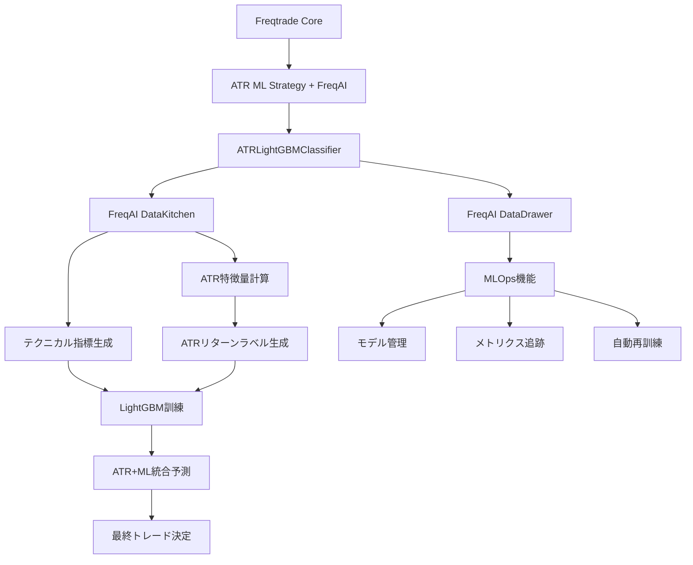

# 技術設計文書 - FreqAI統合版

## 概要

**目的**: richmanbtcチュートリアルの1次+2次モデル概念をFreqAIのMLOpsフレームワーク内で実現し、エンタープライズ級の機械学習運用基盤上でATRベース2層トレーディングシステムを提供します。

**ユーザー**: Freqtradeを使用する定量トレーダーと戦略開発者が、MLOps統合された高度なトレーディング戦略を活用します。

**影響**: FreqAIの既存MLOpsインフラを活用することで、カスタム実装の複雑性を排除し、標準化されたMLワークフローでrichmanbtc概念を実現します。

### 目標

- richmanbtcの1次（ATR）+2次（ML分類）概念の完全保持
- FreqAIのMLOpsインフラ活用による運用品質向上
- 標準化されたパターンによる開発・保守負担の軽減
- エンタープライズ級MLOps機能（自動再訓練、監視、実験管理）の実現

### 非目標

- FreqAIフレームワークの機能拡張や変更
- 独立したMLOpsインフラの構築
- FreqAI以外のML実装との互換性確保

## FreqAI統合アーキテクチャ

### 全体システム構成



### FreqAI統合の戦略的利点

**概念的整合性**:

- richmanbtcの1次+2次モデル構造を完全保持
- ATRの独立性と階層的関係性の維持
- FreqAI内でのカスタムロジック実装による柔軟性

**技術的統合性**:

- FreqAIの既存MLOpsインフラを100%活用
- BaseClassifierModelパターンによる標準化
- data_kitchen/data_drawerによる自動化

**運用的優位性**:

- 自動再訓練・モデル管理・監視機能
- 複数モデル同時実行と比較評価
- エンタープライズ級の障害対応

## 既存システム統合戦略

### Freqtrade Core統合

**IStrategy統合**:

```python
class ATRMLStrategy(IStrategy):
    def populate_any_indicators(self, pair, df, tf, informative=None, **kwargs):
        # FreqAI統合による自動特徴量生成・予測
        df = self.freqai.start(df, None, self.dp, pair)
        return df

    def populate_entry_trend(self, df, metadata):
        # FreqAI予測結果とATR価格の統合判定
        df.loc[df['&do_predict'] == 1, 'enter_long'] = 1
        return df
```

**データプロバイダー活用**:

- FreqAI data_kitchenがDataProvider経由で履歴データ取得
- リアルタイムデータストリームの自動処理
- タイムフレーム管理とデータ同期の自動化

### FreqAI Core統合

**BaseClassifierModel活用**:

```python
class ATRLightGBMClassifier(BaseClassifierModel):
    # FreqAIの標準パターンに準拠した実装
    # 既存のLightGBMClassifier拡張による安定性確保
```

**特徴量エンジニアリング統合**:

```python
def feature_engineering_expand_all(self, dataframe, period, **kwargs):
    # ATR計算 + 標準テクニカル指標
    dataframe['atr'] = ta.ATR(dataframe, timeperiod=self.atr_period)
    # FreqAIパイプラインとの統合
    return super().feature_engineering_expand_all(dataframe, period, **kwargs)
```

**ターゲット生成統合**:

```python
def set_freqai_targets(self, dataframe, **kwargs):
    # ATRリターンベースのラベル生成
    dataframe['&-target_atr_success'] = self.calculate_atr_returns(dataframe)
    return dataframe
```

### MLOpsパイプライン統合

**自動化フロー**:

1. **データ取得**: FreqAI data_kitchenが自動でOHLCVデータ処理
2. **特徴量生成**: feature_engineering_*メソッドによる自動計算
3. **ラベル生成**: set_freqai_targetsでATRリターンベースラベル
4. **モデル訓練**: fit()メソッドで特徴量→ATR成功確率学習
5. **予測実行**: predict()でATR価格計算+ML予測統合
6. **結果管理**: data_drawerによる予測結果永続化

## 保守性と開発者負担分析

### 開発負担の大幅軽減

**学習コストの最小化**:

- ✅ **標準パターン**: BaseClassifierModel継承による一貫性
- ✅ **既存ドキュメント**: FreqAIの充実したドキュメンテーション活用
- ✅ **コミュニティサポート**: FreqAI開発者コミュニティの知見活用
- ✅ **例示コード**: 既存LightGBMClassifierを参考にした実装

**コード再利用性の向上**:

- ✅ **共通基盤**: 他のFreqAI予測モデルとの共通アーキテクチャ
- ✅ **モジュール化**: ATR計算ロジックの独立化・再利用化
- ✅ **設定管理**: FreqAI設定フォーマットによる標準化

### 類似モデル開発の効率化

**テンプレート化による効率性**:

```python
# 基本テンプレート（ATRLightGBMClassifier）
class TwoTierLightGBMClassifier(BaseClassifierModel):
    def calculate_primary_model_returns(self, dataframe):
        # 1次モデルロジック（オーバーライド可能）
        pass

    def fit(self, data_dictionary, dk, **kwargs):
        # 標準的な2層モデル訓練パターン
        primary_returns = self.calculate_primary_model_returns(data_dictionary)
        # ... 共通ML訓練ロジック
```

**拡張性の確保**:

- 🔄 **1次モデル変更**: ATR → RSI, MACD等への切り替え容易
- 🔄 **2次モデル変更**: LightGBM → XGBoost, CatBoost等への切り替え
- 🔄 **特徴量拡張**: FreqAI標準メソッドによる特徴量追加

### 保守性の向上

**標準化による保守性**:

- 📋 **一貫性**: FreqAIパターンによる予測可能な構造
- 🔧 **デバッグ性**: FreqAI標準ログとメトリクスによる問題特定
- 🚀 **アップデート対応**: Freqtradeアップデートへの自動追従

**技術債務の最小化**:

- ⚡ **依存関係管理**: FreqAI標準依存関係による安定性
- 🔒 **セキュリティ**: FreqAIセキュリティアップデートの恩恵
- 📈 **パフォーマンス**: FreqAI最適化の自動継承

## 具体的実装方法

### 1. ATRLightGBMClassifierクラス設計

```python
from freqtrade.freqai.base_models.BaseClassifierModel import BaseClassifierModel
from freqtrade.freqai.data_kitchen import FreqaiDataKitchen
import talib as ta
import pandas as pd
import numpy as np
from lightgbm import LGBMClassifier

class ATRLightGBMClassifier(BaseClassifierModel):
    """
    richmanbtcチュートリアルの1次+2次モデル概念をFreqAI内で実現
    """

    def __init__(self, config: dict) -> None:
        super().__init__(config)
        self.atr_period = config.get('atr_period', 14)
        self.atr_multiplier = config.get('atr_multiplier', 0.5)

    def feature_engineering_expand_all(self, dataframe: pd.DataFrame,
                                      period: int, **kwargs) -> pd.DataFrame:
        """
        1次モデル（ATR）計算 + 2次モデル用特徴量生成
        """
        # ATR計算（1次モデル基盤）
        dataframe['atr'] = ta.ATR(dataframe['high'], dataframe['low'],
                                 dataframe['close'], timeperiod=self.atr_period)

        # ATR基準価格計算
        dataframe['atr_buy_price'] = dataframe['close'] - (dataframe['atr'] * self.atr_multiplier)
        dataframe['atr_sell_price'] = dataframe['close'] + (dataframe['atr'] * self.atr_multiplier)

        # 標準特徴量生成（FreqAI継承）
        dataframe = super().feature_engineering_expand_all(dataframe, period, **kwargs)

        return dataframe

    def set_freqai_targets(self, dataframe: pd.DataFrame, **kwargs) -> pd.DataFrame:
        """
        ATRリターンベースのラベル生成（richmanbtc概念の核心）
        """
        # ATR戦略のリターン計算（1次モデル成果）
        dataframe['atr_returns'] = self.calculate_atr_returns(dataframe)

        # 2次モデル用ラベル：ATR戦略の成功/失敗
        dataframe['&-target_atr_success'] = (dataframe['atr_returns'] > 0).astype(int)

        return dataframe

    def calculate_atr_returns(self, dataframe: pd.DataFrame) -> pd.Series:
        """
        ATR戦略の理論リターン計算（1次モデルロジック）
        """
        # richmanbtcチュートリアルに基づくATRリターン計算
        returns = pd.Series(index=dataframe.index, dtype=float)

        for i in range(1, len(dataframe)):
            current_price = dataframe['close'].iloc[i]
            prev_atr_buy = dataframe['atr_buy_price'].iloc[i-1]
            prev_atr_sell = dataframe['atr_sell_price'].iloc[i-1]

            # ATR指値戦略のリターン計算
            if current_price <= prev_atr_buy:  # 買い指値約定
                returns.iloc[i] = (current_price - prev_atr_buy) / prev_atr_buy
            elif current_price >= prev_atr_sell:  # 売り指値約定
                returns.iloc[i] = (prev_atr_sell - current_price) / current_price
            else:
                returns.iloc[i] = 0

        return returns

    def fit(self, data_dictionary: dict, dk: FreqaiDataKitchen, **kwargs) -> Any:
        """
        2次モデル訓練：テクニカル特徴量でATR成功確率学習
        """
        # 特徴量とターゲット取得
        X = data_dictionary["train_features"]
        y = data_dictionary["train_labels"]["&-target_atr_success"].astype(int)

        # FreqAI標準の訓練・検証分割
        if self.freqai_info.get("data_split_parameters", {}).get("test_size", 0.1) == 0:
            eval_set = None
        else:
            eval_set = [(data_dictionary["test_features"],
                        data_dictionary["test_labels"]["&-target_atr_success"].astype(int))]

        # LightGBM訓練
        model = LGBMClassifier(**self.model_training_parameters)
        model.fit(
            X=X, y=y,
            eval_set=eval_set,
            sample_weight=data_dictionary["train_weights"],
        )

        return model

    def predict(self, unfiltered_df: pd.DataFrame, dk: FreqaiDataKitchen,
               **kwargs) -> Tuple[pd.DataFrame, pd.DataFrame]:
        """
        1次+2次モデル統合予測
        """
        # 特徴量準備
        filtered_df, _ = dk.filter_features(
            unfiltered_df, dk.training_features_list, training_filter=False
        )

        # 2次モデル予測（ATR成功確率）
        ml_predictions = self.model.predict_proba(filtered_df)[:, 1]

        # 1次+2次統合決定
        predictions = pd.DataFrame(index=filtered_df.index)

        # ATR価格計算（1次モデル）
        predictions['atr_buy_price'] = unfiltered_df['close'] - (
            unfiltered_df['atr'] * self.atr_multiplier
        )

        # ML予測との統合（2次モデルフィルタリング）
        ml_threshold = self.freqai_info.get('ml_threshold', 0.5)
        predictions['&do_predict'] = (ml_predictions > ml_threshold).astype(int)

        # ATR価格は常に計算、MLが可否を決定
        predictions['&-atr_entry_price'] = predictions['atr_buy_price']

        return predictions, filtered_df.fillna(0)
```

### 2. 戦略統合実装

```python
class ATRMLStrategy(IStrategy):
    """
    FreqAI統合ATR+ML戦略
    """
    def __init__(self, config: dict) -> None:
        super().__init__(config)
        # FreqAI設定
        self.freqai_info = config["freqai"]

    def populate_any_indicators(self, pair: str, df: pd.DataFrame, tf: str,
                               informative: pd.DataFrame = None, **kwargs) -> pd.DataFrame:
        """
        FreqAI統合による自動特徴量生成・予測
        """
        df = self.freqai.start(df, None, self.dp, pair)
        return df

    def populate_entry_trend(self, df: pd.DataFrame, metadata: dict) -> pd.DataFrame:
        """
        FreqAI予測結果による2層判定
        """
        df.loc[
            (df['&do_predict'] == 1),  # ML予測OK
            'enter_long'
        ] = 1

        return df

    def custom_entry_price(self, pair: str, trade: Optional[Trade],
                          current_time: datetime, proposed_rate: float,
                          entry_tag: str, side: str, **kwargs) -> float:
        """
        ATR計算価格での指値注文
        """
        latest_candle = self.dp.get_latest_candle(pair)

        if '&-atr_entry_price' in latest_candle:
            return latest_candle['&-atr_entry_price']

        return proposed_rate  # フォールバック
```

### 3. 設定ファイル設計

```json
{
    "freqai": {
        "model_training_parameters": {
            "n_estimators": 100,
            "learning_rate": 0.1,
            "max_depth": -1,
            "random_state": 42
        },
        "feature_parameters": {
            "include_timeframes": ["5m", "15m"],
            "include_corr_pairlist": ["BTC/USDT", "ETH/USDT"],
            "label_period_candles": 1,
            "DI_threshold": 0.5
        },
        "atr_period": 14,
        "atr_multiplier": 0.5,
        "ml_threshold": 0.6,
        "identifier": "ATRLightGBMClassifier",
        "model_save_type": "disk"
    }
}
```

## このアプローチのデメリット分析

### 技術的制約

**FreqAIフレームワーク依存**:

- ❌ **学習コスト**: FreqAI特有の概念・パターン習得が必要
- ❌ **カスタマイゼーション制限**: FreqAI設計思想の範囲内での実装
- ❌ **デバッグ複雑性**: FreqAI内部動作の理解が必要

**パフォーマンス考慮**:

- ⚠️ **オーバーヘッド**: FreqAIレイヤーによるわずかな処理遅延
- ⚠️ **メモリ使用量**: data_kitchen/data_drawerによる追加メモリ消費
- ⚠️ **ストレージ要件**: MLOps機能による予測結果・メトリクス保存

### 運用上の制約

**FreqAIアップデート依存**:

- 🔄 **破壊的変更リスク**: FreqAI APIの将来的変更影響
- 🔄 **移行コスト**: 大幅なFreqAIアップデート時の対応負荷
- 🔄 **バージョン管理**: FreqAI互換性確保の継続的対応

**概念的制約**:

- 🎯 **純粋性の妥協**: richmanbtc概念の一部FreqAI適応
- 🎯 **独立性の制限**: 1次モデルの完全独立性の軽微な制約

### 緩和策

**学習コスト対策**:

- 📚 **段階的学習**: FreqAI基本概念から順次習得
- 🤝 **コミュニティ活用**: FreqAI開発者コミュニティとの連携
- 📖 **ドキュメンテーション**: 詳細な実装ガイド作成

**技術的制約対策**:

- 🔧 **モジュール設計**: ATRロジックの独立性確保
- 🧪 **テスト充実**: FreqAIアップデート耐性確保
- 📊 **監視強化**: パフォーマンスメトリクス継続監視

## MLOps実現方法

### 自動化されたMLワークフロー

**モデルライフサイクル管理**:

```python
# FreqaiDataDrawer自動機能
- モデルバージョニング: タイムスタンプベース自動管理
- モデル永続化: pickle/joblib形式での自動保存
- モデル読み込み: 最新モデル自動選択・読み込み
- 古いモデル削除: 設定可能な保持期間での自動削除
```

**メトリクス追跡・監視**:

```python
# metric_tracker機能
- 予測精度: リアルタイム精度追跡
- 特徴量重要度: 定期的な重要度更新
- モデル性能: 時系列での性能変化監視
- ドリフト検出: データ分布変化の自動検出
```

**自動再訓練システム**:

```python
# check_if_new_training_required機能
- 期間ベース: 設定間隔での自動再訓練
- 性能ベース: 精度低下時の自動再訓練
- データベース: 新データ蓄積時の自動再訓練
- 条件カスタマイズ: ビジネス要件に応じた再訓練トリガー
```

### 実験管理・A/Bテスト

**複数モデル同時実行**:

```python
# FreqAI identifier設定
"freqai": {
    "identifier": "ATRLightGBM_v1",  # モデルA
    "feature_parameters": {...}
}

"freqai": {
    "identifier": "ATRLightGBM_v2",  # モデルB
    "model_training_parameters": {"n_estimators": 200}
}
```

**パフォーマンス比較**:

- 📊 **リアルタイム比較**: 複数モデルの同時パフォーマンス監視
- 📈 **統計的検定**: A/Bテスト結果の有意性検証
- 🎯 **最適モデル選択**: 性能メトリクスによる自動選択

### 障害対応・フォールバック

**モデル有効性チェック**:

```python
# check_if_model_expired機能
- 有効期限チェック: モデル訓練からの経過時間監視
- 性能劣化検出: 閾値を下回った場合のアラート
- 自動フォールバック: 主要モデルから簡単ルールへの切り替え
```

**データ品質監視**:

```python
# データ異常検出
- 欠損値増加: 予期しないデータ欠損の検出
- 分布変化: 特徴量分布の大幅な変化検出
- 外れ値増加: 異常な市場状況の自動検出
```

### MLOps設定例

```json
{
    "freqai": {
        "train_period_days": 30,
        "backtest_period_days": 7,
        "identifier": "ATRLightGBM_Production",

        "model_save_type": "disk",
        "purge_old_models": 5,  // 5つまでのモデル保持

        "feature_parameters": {
            "principal_component_analysis": false,
            "use_SVM_to_remove_outliers": true,
            "DI_threshold": 0.5,
            "weight_factor": 0.8
        },

        "data_split_parameters": {
            "test_size": 0.2,
            "shuffle": false
        },

        "model_training_parameters": {
            "n_estimators": 100,
            "learning_rate": 0.1,
            "max_depth": 7,
            "num_leaves": 31,
            "random_state": 42
        }
    }
}
```

## 開発・検証・デプロイメントフロー

### 開発環境での安全な開発

**Phase 1: ドライラン開発**

```bash
# FreqAIドライランモードでの安全な開発
freqtrade backtesting --config config.json --strategy ATRMLStrategy --dry-run-wallet 10000
```

**開発環境特徴**:

- 🔒 **ゼロリスク**: 実資金への影響なし
- ⚡ **高速フィードバック**: 即座の結果確認
- 🧪 **実験自由度**: パラメータ変更の自由な試行
- 📊 **詳細ログ**: FreqAI debug モードでの内部動作確認

### バックテスト検証

**Phase 2: 履歴データ検証**

```bash
# 包括的バックテスト実行
freqtrade backtesting \
    --config config.json \
    --strategy ATRMLStrategy \
    --timeframe 5m \
    --timerange 20230101-20231231 \
    --breakdown month
```

**検証内容**:

- 📈 **パフォーマンス評価**: シャープレシオ、最大ドローダウン、勝率
- 🔄 **複数期間テスト**: 異なる市場状況での性能検証
- ⚖️ **A/Bテスト**: ATRのみ vs ATR+ML の比較
- 📊 **統計的検定**: 性能改善の統計的有意性確認

### ライブ検証（Paper Trading）

**Phase 3: リアルタイム検証**

```bash
# Paper trading mode
freqtrade trade \
    --config config.json \
    --strategy ATRMLStrategy \
    --dry-run
```

**検証項目**:

- 🕐 **レイテンシ**: 予測処理時間の実測
- 🔄 **モデル更新**: 自動再訓練の動作確認
- 📡 **データフィード**: リアルタイムデータ処理の安定性
- 🚨 **エラーハンドリング**: 例外状況での適切な対応

### プロダクション段階デプロイ

**Phase 4: 段階的本番投入**

```bash
# 少額実資金での検証
freqtrade trade \
    --config config_production.json \
    --strategy ATRMLStrategy \
    --enable-dry-run-logging
```

**段階的デプロイ戦略**:

1. **10%投入**: 少額での初期検証（1週間）
2. **30%投入**: 中間規模での安定性確認（2週間）
3. **70%投入**: 大部分投入での効果測定（1ヶ月）
4. **100%投入**: 全面展開

**監視体制**:

- 📊 **リアルタイム監視**: Grafana + InfluxDB での監視ダッシュボード
- 🚨 **アラート設定**: 性能劣化・エラー発生時の即座通知
- 📈 **日次レポート**: パフォーマンス・メトリクスの定期報告
- 🔄 **週次レビュー**: モデル性能・設定調整の定期見直し

### デプロイメント自動化

**CI/CD パイプライン例**:

```yaml
# .github/workflows/deploy.yml
name: ATR ML Strategy Deploy
on:
  push:
    branches: [main]

jobs:
  test:
    runs-on: ubuntu-latest
    steps:
      - uses: actions/checkout@v2
      - name: Run Backtest
        run: |
          freqtrade backtesting --config config_test.json

  deploy:
    needs: test
    runs-on: ubuntu-latest
    steps:
      - name: Deploy to Production
        run: |
          # Production server deployment
          scp strategy_files production_server:/path/to/freqtrade/
          ssh production_server "freqtrade trade --config config.json"
```

### 運用監視・保守

**日常運用フロー**:

- 🌅 **朝**: 夜間パフォーマンスレポート確認
- 🕐 **日中**: リアルタイム監視ダッシュボードチェック
- 🌅 **夕**: 日次統計レポート分析
- 📅 **週次**: モデル性能評価・パラメータ調整検討
- 📅 **月次**: 戦略全体の包括的見直し

**継続的改善**:

- 📊 **A/Bテスト継続**: 新機能・パラメータの継続的検証
- 🔄 **モデル進化**: 新しいアルゴリズム・特徴量の検証
- 📈 **パフォーマンス最適化**: 処理効率・精度向上の継続的改善

### TensorBoard統合（ローカル開発環境専用）

**Phase 2での利用範囲**:

TensorBoardはCI/CD環境では使用せず、**ローカル開発環境でのモデル訓練監視のみ**に限定します。

**ローカル環境での設定**:

```json
{
    "freqai": {
        "tensorboard_log_dir": "user_data/tensorboard_logs",
        "feature_parameters": {
            "include_timeframes": ["5m", "15m"],
            "DI_threshold": 0.5
        }
    }
}
```

**TensorBoard起動方法**:

```bash
# ローカル開発マシンで実行
cd /path/to/freqtrade
tensorboard --logdir=user_data/tensorboard_logs --host=localhost --port=6006

# アクセス: http://localhost:6006
```

**監視対象メトリクス**:

- モデル訓練損失とバリデーション損失
- 特徴量重要度の時系列変化
- 予測精度メトリクス
- LightGBMの早期停止状況

**CI/CD環境での代替案**:

- バックテスト結果のJSON出力とアーティファクト保存
- 主要メトリクスのテキストレポート生成
- 性能劣化時のアラート機能（Slack/Email通知）

---

## 実現可能性分析と重要な懸念点

### 実現可能性評価：70-80%（条件付き）

FreqAI統合は**技術的には実装可能**ですが、**richmanbtc概念の価値毀損リスク**が存在します。

### 重要な懸念点

#### 1. ATRの独立性保証問題（最重要）

**richmanbtcの理想**：

```python
# 完全独立したATRリターン生成
atr_returns = calculate_atr_returns_independently(market_data)
ml_prediction = predict_atr_success(market_features, atr_returns)
```

**FreqAI統合の現実**：

```python
# ATR計算がFreqAIのデータフローに組み込まれる
def feature_engineering_expand_all(self, dataframe, period, **kwargs):
    dataframe['atr'] = ta.ATR(...)  # FreqAI制御下
    return super().feature_engineering_expand_all(...)  # FreqAI依存
```

#### 2. データフロー概念の根本的相違

- **richmanbtc設計**: `ATRリターン` → `ML学習ターゲット`
- **FreqAI設計**: `市場データ` → `特徴量` → `entry/exit予測`

#### 3. リアルタイム同期問題

FreqAIの非同期データ処理により、ATR価格計算とML予測のタイミング同期に課題

#### 4. 概念純粋性の毀損リスク

FreqAIフレームワーク内でのrichmanbtc実装により、階層的決定プロセスの独立性が損なわれる可能性

## richmanbtcパフォーマンス要因分析

### 核心的価値

#### 1. 階層的決定プロセス

- **1次モデル（ATR）**: 市場ノイズの独自フィルタリング
- **2次モデル（ML）**: ATRリターンの成功パターン学習
- **効果**: 単純ML予測より高精度の実現

#### 2. 適応的リスク管理

- ATRによる動的閾値調整
- 市場ボラティリティへの自動適応

#### 3. 指値戦略の優位性

- スプレッド回避による取引コスト削減
- 流動性提供による価格改善効果

#### 4. 時系列的一貫性

- 過去のATR成功パターンの学習
- 将来予測精度の継続的向上

### パフォーマンス向上の実現方法

#### ATRの独立性確保

```python
class IndependentATRCalculator:
    """FreqAIから完全に独立したATR計算器"""
    def calculate_atr_returns(self, ohlcv_data):
        # richmanbtcアルゴリズムの忠実実装
        # FreqAIデータパイプラインに依存しない
```

#### 階層的学習の実装

```python
def train_ml_model(market_features, atr_returns_history):
    # MLは「市場データ」ではなく「ATRリターンの成功パターン」を学習
    labels = (atr_returns_history > 0).astype(int)
    return lgb_model.fit(market_features, labels)
```

## 段階的実装計画

### 実装戦略：3フェーズ・プルリクエスト分割

概念価値の保護とリスク最小化のため、段階的実証アプローチを採用します。

#### Phase 1: 純粋実装による概念実証

**プルリクエスト #1**

**目的**:

- richmanbtc概念の忠実な再現
- ベンチマーク性能の確立
- 実装の技術的実現可能性検証

**実装内容**:

- `IndependentATRStrategy`クラス（IStrategy継承）
- `ATRCalculator`ユーティリティクラス
- `LightGBMPredictor`独立実装
- 基本的なFeatureEngineer実装
- 基本的なバックテストとメトリクス

**実装しないもの**:

- FreqAI統合機能
- 高度なMLOps機能
- 複雑な特徴量エンジニアリング
- 自動再訓練システム

**成功基準**:

- richmanbtcチュートリアルと同等のバックテスト結果
- ATRの独立性完全保持
- 階層的決定プロセスの正常動作

**実装ファイル**:

```
user_data/strategies/IndependentATRStrategy.py
user_data/strategies/utils/atr_calculator.py
user_data/strategies/utils/lightgbm_predictor.py
user_data/strategies/utils/feature_engineer.py
```

#### Phase 2: ハイブリッド統合による最適化

**プルリクエスト #2**

**目的**:

- ATR独立性を保持したMLOps部分活用
- 運用品質向上（監視・管理・実験）
- FreqAIツールの選択的統合

**実装内容**:

- `HybridATRStrategy`クラス
- FreqAI監視ツールの部分活用
- メトリクス追跡・レポート機能
- A/Bテスト機能
- 設定管理の標準化

**実装しないもの**:

- FreqAIのコアデータフロー統合
- BaseClassifierModel継承
- FreqAI feature_engineering依存
- 完全なdata_kitchen/data_drawer統合

**成功基準**:

- Phase 1と同等以上の性能維持
- MLOps機能の実用的価値確認
- ATR独立性の完全保持

**実装ファイル**:

```
user_data/strategies/HybridATRStrategy.py
user_data/strategies/utils/freqai_tools.py
user_data/strategies/utils/metrics_tracker.py
user_data/strategies/utils/experiment_manager.py
```

#### Phase 3: 性能検証と最適解選択

**プルリクエスト #3**

**目的**:

- 全アプローチの包括的比較
- 最適解の決定と標準化
- プロダクション対応強化

**実装内容**:

- `OptimalATRStrategy`（最良アプローチの選択）
- 包括的性能比較ツール
- プロダクション監視機能
- CI/CD統合
- ドキュメンテーション完備

**実装しないもの**:

- 性能劣化が確認されたアプローチ
- 概念純粋性を毀損する機能
- 過度に複雑な実装

**成功基準**:

- 最適パフォーマンスの実現
- プロダクション運用準備完了
- 長期保守性の確保

**判定基準**:

- **Phase 1 → Phase 2**: ハイブリッド統合で性能向上または同等維持
- **Phase 2 → Phase 3**: MLOps恩恵と概念純粋性の最適バランス確認
- **Phase 3**: 総合的に最も価値の高いアプローチを選択

### フェーズ間移行ゲート

#### Phase 1 → Phase 2 移行条件

- ✅ richmanbtc概念の忠実実装確認
- ✅ ベンチマーク性能達成
- ✅ ATR独立性検証完了

#### Phase 2 → Phase 3 移行条件

- ✅ ハイブリッド統合の性能検証
- ✅ MLOps機能の実用価値確認
- ✅ 概念純粋性の保持確認

#### Phase 3 完了条件

- ✅ 最適アプローチの確定
- ✅ プロダクション運用準備完了
- ✅ 長期保守計画策定

### リスク軽減策

#### 概念価値保護

- 各フェーズでATR独立性の厳格な検証
- richmanbtc原理からの逸脱防止
- 性能劣化時の即座フォールバック

#### 技術的リスク対応

- 段階的実装による影響範囲限定
- 各フェーズでの包括的テスト
- 継続的な性能監視

#### プロジェクトリスク管理

- 明確な成功基準設定
- フェーズ間の客観的評価
- 必要に応じた計画修正

## 結論

段階的実装計画により、richmanbtcの概念的価値を保護しつつ、MLOpsの実用的恩恵を段階的に評価・統合できます。各フェーズの成果を基に最適解を選択し、概念純粋性と運用品質の最良バランスを実現します。

初期の概念実証により理論と実装のギャップを明確化し、リスクを最小化しながら最大価値を追求します。
